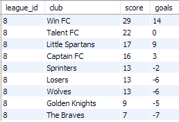
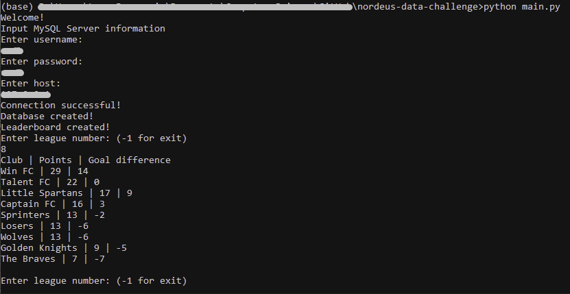

# Nordeus - Data Engineering Challenge 2021

## Summary
&nbsp;&nbsp;&nbsp;&nbsp;The goal of this application is to create leaderboard based on input league number and previously generated events. Application consists of two parts: 
  * [Cleaning data from generated events in JSON file](#cleaning-data)
  * [Creating Leaderboard table on MySQL Server](#creating-leaderboard)

&nbsp;&nbsp;&nbsp;&nbsp;Generated data is stored in [events.jsonl](https://github.com/leonjovanovic/nordeus-data-challenge/blob/main/events.jsonl) file. Each row in the file represents one event. Event can either be match start, goal or match end. Each event has multiple fields that describe that event in detail.

&nbsp;&nbsp;&nbsp;&nbsp; [Instructions on starting and using application are at the bottom](#running-the-application)

## Cleaning data
&nbsp;&nbsp;&nbsp;&nbsp;Data is first imported from JSONL file using [Pandas library](https://pandas.pydata.org/docs/reference/api/pandas.io.json.read_json.html) and converted to list of [dictionaries](https://docs.python.org/3/tutorial/datastructures.html#dictionaries). Cleaning process is divided into 4 steps:
  * Deleting duplicate events with same *event_id* field.
  * Deleting events with incorect *event_data* field.
  * Deleting goal events which have incorrect time or dont have corresponding match start/end events.
  * Deleting invalid match start/end event pairs.

&nbsp;&nbsp;&nbsp;&nbsp;Deleting duplicate events is done by creating boolean array with biggest *event_id* number elements. At the beginning every element in array is set to *False*. In first pass throughout data list, each event with first-seen *event_id* will trigger field in *array[event_id]* to *True*. Every next event with *event_id* that already triggered field in array will be added to list for future removal.

---
&nbsp;&nbsp;&nbsp;&nbsp;Detecting and deleting events with incorect *event_data* field is achieved by checking each event (row) in first pass for irregularities. If contents of *event_data* don't have all fields or if any field inside *event_data* isn't correct data type, that event will be flagged for removal. 

---
&nbsp;&nbsp;&nbsp;&nbsp;For deleting invalid goal events we had to create two additional arrays. Each array will, at the end of first pass, have timestamps of match start and match end. Row number in the arrays corresponds to *match_id*, similar to *event_id array*. In second pass we check each goal event timestamp to see if its between match start and match end timestamp. If not, those events will be removed at the end of the second pass.

---
&nbsp;&nbsp;&nbsp;&nbsp;Last step is deleting ivalid match start/end event pairs, which is done by checking above mentioned match arrays to see if there is any index that exists in one and does not exists in other array. If there is such case, *match_id* is flagged and during second pass every event with that *match_id* will be removed.

## Creating Leaderboard
&nbsp;&nbsp;&nbsp;&nbsp; To get Leaderboard for every league, data had to be inserted into two tables: matches and goals. Match table has *match_id*, *league_id*, *home_club* and *away_club* columns, while goal table has *event_id*, *match_id* and *scoring_club*. They are filled by going throughout cleaned data and inserting it row by row.

&nbsp;&nbsp;&nbsp;&nbsp; From Match and Goal table, Scores table is created which represents Match table with 2 additional columns. Those 2 columns are number of goals that home and away club scored on match. They are calculated by *FULL OUTER JOIN* in SQL between two Goal tables and added to Match table with *LEFT OUTER JOIN*. MySQL does not have *FULL OUTER JOIN* so it was simulated using *UNION* of *LEFT* and *RIGHT OUTER JOIN*. Teams table is also created and it lists every team grouped by league number. 

&nbsp;&nbsp;&nbsp;&nbsp; Leaderboard table is finally created from Scores and Teams tables. Using *LEFT OUTER JOIN* on two queries, victory and draw points are calculated and summed, while goal difference is calculated by different query and added to table again using *LEFT OUTER JOIN*.

*Leaderboard of league 8 in MySQL*

## Running the application

&nbsp;&nbsp;&nbsp;&nbsp; To run this application, you first need to install Python and clone this repository to your PC. After that, using CMD go to location of local repository and execute `python main.py`. If program started correctly, you need to input MySQL Server informations (username, password and host) and to type number of league whose Leaderboard you want to see.

*Leaderboard of league 8 in CMD*
